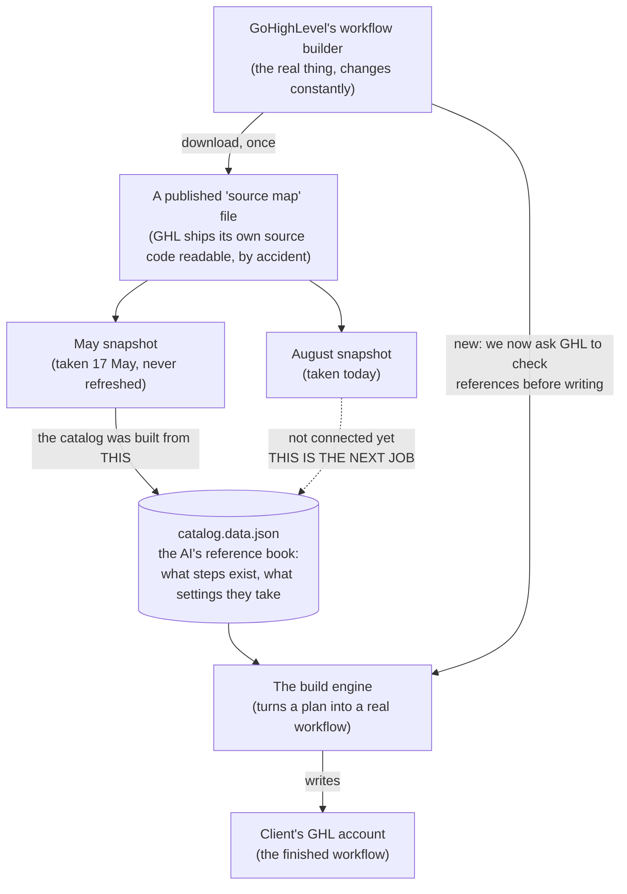

# GHL Workflow Builder: Status Report (21 Aug 2026)

## Where things stand (the forest)

The goal you set: make the workflow engine build GoHighLevel automations correctly every time,
and never fail silently. The expensive failure is not a loud crash. It is a workflow that saves
clean, publishes clean, and quietly does the wrong thing for three weeks.

Today started as an audit of the workflow "catalog", which is the reference file the AI reads to
know what steps exist in GHL and what settings each one takes. It ended somewhere different. The
catalog is not subtly wrong. It is badly out of date, and we found out why: it was built from a
one-time snapshot of GoHighLevel's own code taken in May, and GoHighLevel has changed about half
of that code since.

Two real fixes shipped to the working copy today, both proven against the live GROM AU account.
The bigger job, rebuilding the catalog from a fresh snapshot, is now unblocked and scoped. Nothing
has been committed or released yet, so none of this is live to the AI tools.

## How it's built (the map)



**How to read it:** GoHighLevel accidentally publishes its own source code in a readable form (a
"source map", which is a debugging file most companies leave switched on). We download that and
turn it into the AI's reference book. The problem is the dotted line: the reference book was built
from the May download and was never reconnected to a fresh one. Everything downstream of it, the
build engine and every workflow it creates, inherits May's knowledge of GoHighLevel.

## What got done, and why it matters (the trees)

All work below is mine, done in this session.

**1. Fixed a graph bug that made GHL reject workflows**

*What was built:* When the engine builds a workflow, every step records which step comes before
it. For the very first step there is no previous step, and the engine was writing the word "null"
in that slot. GoHighLevel never does that. It leaves the slot out entirely.

*Why it was done:* You hit this last week. A ten second wait step got rejected by the builder with
a complaint about a missing parent link, and you fixed it by retyping the number and saving. I
checked 310 of your real workflows, 3,958 steps in total. The word "null" appears in that slot
zero times. I also watched GoHighLevel's own builder save a workflow and confirmed it omits the
slot. Three separate sources agree the engine was wrong.

*What it changes:* One line in the engine, plus the test that was locking in the wrong behaviour.
Worth noting the test suite caught that my first attempt was incomplete: the fresh build path
started omitting the slot while the edit path still wrote "null", and a round trip test flagged
the mismatch. That test earned its keep.

**2. The engine now asks GoHighLevel to check its work before writing anything**

*What was built:* While watching the real builder, I found an endpoint nobody knew about. You hand
it a draft workflow and it tells you which things the workflow points at that do not actually
exist: a deleted user, a removed workflow, a missing asset. The engine now calls it before it
creates anything.

*Why it was done:* You made the point yourself: even when a failure is caused by something missing
in the account rather than a bug in our code, the engine still has to *notice*. Previously the
engine would build the workflow, save it, and only find out later, if ever.

*What it changes:* Proven live on GROM AU. I fed it a workflow assigning a task to a user ID that
does not exist. Result:

```
ABORTED: GHL rejected 1 asset reference(s) before any write:
  Referenced User does not exist or does not belong to this location.
```

Then I checked the account: zero workflows created. It stopped before touching anything. It is
deliberately built to fail *open*, meaning if that endpoint is ever down or slow, the build carries
on as before. A new safety check must not become a new way for working builds to break.

Test results: 485 of 485 engine tests pass, 757 of 757 server tests pass.

**3. Found out why the catalog is wrong, and measured it**

*What was built:* A fresh download of GoHighLevel's current source, and a comparison against the
May one.

*Why it was done:* You said it plainly: "what we have locally might not be enough." You were right,
and it was the most useful thing said today. I had been treating the May files as fact.

*What it changes:* The numbers are stark. In three months GoHighLevel changed 181 of the 382 files
we had, added 117 new ones, and removed 54. That is roughly half the codebase per quarter.

The clearest example is the Wait step, the most used step in any workflow:

| | Then | Now |
|---|---|---|
| Kinds of wait GHL offers | 9 | **13** |
| Settings the Wait step accepts | about 21 | **57** |
| Settings the catalog knows about | 2 | **2** |

The AI's reference book knows two settings out of fifty seven, on the most common step there is.

Four step types exist in GoHighLevel that the catalog has never heard of, including
"remove from all workflows". If you asked the AI to remove a contact from every workflow today, it
would tell you that is not possible.

One important piece of good news: of the 11 setting lists that changed, **none lost options**. The
drift is purely additions. Nothing the catalog already knows has become wrong. Every problem is a
gap, not an error, which makes rebuilding it low risk.

## What I claimed vs. what actually held up

I got things wrong today and they were caught, which is worth recording honestly.

⚠️ **I published wrong numbers.** I wrote up a design document citing a "659 workflow corpus" and
"436 model files". The real figures are 326 workflows and 160 model files. I had counted the wrong
things and built an argument on top of them. I had an independent audit run against that document,
it came back "materially flawed", and it was right.

⚠️ **My main proposal was wrong.** I proposed copying GoHighLevel's own validation code into our
engine. The audit found that code had holes. Then the fresh download showed those holes were fixed
months ago and I had been reading a stale file. The proposal was built on an artifact, not on
GoHighLevel.

⚠️ **I nearly shipped a feature that does nothing.** The new pre-flight check originally required a
company ID. The engine does not have one. It would have skipped silently on every real build while
all twelve of its tests passed. Only caught by running it against your live account.

⚠️ **A live access token leaked into the session transcript.** My redaction pattern did not match
the file format. The token expired within the hour and is scoped to your own login, but treat that
transcript as sensitive.

Everything reported in the "what got done" section above was verified by running it, not by
reading code.

**See it yourself:**
- Run the engine tests: `cd plugins/uxie-ghl-factory/skills/create-ghl-workflow/engine && node --test *.test.mjs`
- The full evidence log, every finding with what proves it: `docs/superpowers/notes/2026-08-21-workflow-shape-findings.md`
- The empty draft I left on GROM AU while exploring the real builder: workflow `1c38ae6a-4e77-4193-b009-6b224088409e`

## What's next, and what's blocking

**Needs your decision, nothing moves without it:**

1. **Committing today's two fixes.** They are sitting uncommitted on `main`. I do not commit to
   your main branch without you saying so.
2. **Releasing them.** Even once committed, the AI tools will not use them. The tools run the last
   *installed* build, so this needs a version bump and a release to actually reach anything.

**The next piece of work:** rebuild the catalog from today's fresh download. This is what actually
fixes what the AI knows, and it is now unblocked and low risk because the changes are all additions.

**What is blocking it:** the script that builds the catalog lives in a different repository from
the catalog itself, and it looks for its eight input files relative to *that* repo. It cannot
simply be pointed at the new download. This is the ownership tangle you flagged earlier today when
you said this work belongs in `uxie-ghl-factory`. It now has a concrete cost attached.

**After that:** a re-download script that can be run on a schedule. At roughly half the code
changing per quarter, this needs to be a routine check, not a discovery someone makes once a year.

## 🔎 Claude's honest read

The catalog problem was never about method. Your reverse engineering technique was sound, and the
tooling built around it works. The problem was freshness, and nobody had a reason to suspect it
because nothing visibly broke. A workflow built from May's knowledge still saves fine. It just
quietly cannot use anything GoHighLevel shipped since.

That is the thing worth internalising: at this drift rate, any one time extraction has a shelf life
of about a quarter. The most valuable thing to build next is not a better catalog. It is the
re-download script, because it converts "the catalog is stale" from something someone stumbles on
into something you get told about.

On today's two fixes: both are small, both are proven against your live account, and I would commit
them. The pre-flight check in particular pays for itself the first time it stops a workflow
pointing at a deleted calendar.

On my own work: I spent too long writing a design document while the ground kept moving under it,
and you called it out twice before I dropped it. You were right both times. The useful output today
came from measuring and from running things against a real account, not from planning. Worth
remembering for the catalog rebuild, which should start with a fresh measurement, not a document.

One thing I would watch: the evidence log lives in `docs/superpowers/`, which is excluded from
version control in this repo. If that folder matters to you, it needs to move somewhere tracked,
or the next person to look at this pays today's cost again.
